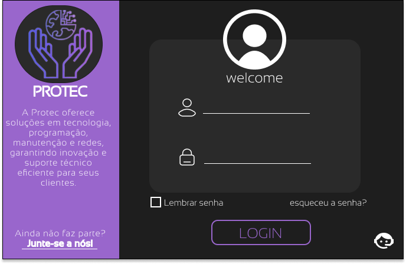
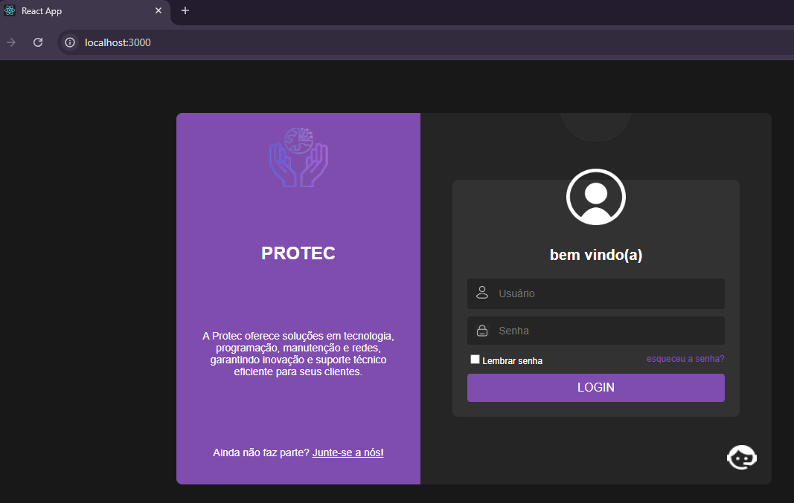

---

# **PROTEC - Interface de Login**

A **Protec** oferece soluções tecnológicas para suporte em redes, manutenção e programação, proporcionando inovação e eficiência. Este projeto é a interface de login da plataforma.



---

## **Descrição do Projeto**

Este site foi projetado para atender às necessidades de design e funcionalidade de um sistema de login moderno e elegante, com os seguintes recursos:

- **Seção de Bem-vindo:** Um cabeçalho estilizado com o texto "welcome" e o ícone do usuário acima.
- **Formulário de Login:**
  - Entrada de usuário e senha.
  - Checkbox para "Lembrar senha".
  - Link para recuperar a senha.
- **Seção Lateral (Informações):**
  - Texto informativo sobre a Protec.
  - Botão "Junte-se a nós!" para convidar novos usuários.

---

## **Recursos Utilizados**

### **HTML**
- Estrutura semântica para elementos da interface.
- Formulário funcional com campos de entrada e botões.

### **CSS**
- **Flexbox** para alinhamento e organização dos elementos.
- Estilização personalizada para cores, fontes e posicionamento:
  - Layout dividido em duas seções.
  - Botões e links estilizados.
  - Efeitos visuais suaves.

---

## **Como Utilizar**

1. **Clonar o repositório:**
   ```bash
   git clone <URL_DO_REPOSITORIO>
   cd task-manager
   ```

2. **Instalar dependências do projeto:**
   ```bash
   npm install
   ```

3. **Executar o site localmente:**
   ```bash
   npm start
   ```

4. Acesse o site em: [http://localhost:3000](http://localhost:3000).

---

## **Imagens do Projeto**

Imagem do site configurado e funcional:



---

## **Customização**

### **Alterar Estilos**
Edite o arquivo `App.css` para ajustar cores, fontes e espaçamentos conforme necessário.

### **Adicionar Funcionalidade**
Edite o arquivo `App.js` para incluir novos recursos, como autenticação via API.

---

## **Ferramentas Utilizadas**

- **React.js**: Biblioteca para construção da interface.
- **CSS**: Estilização do design.
- **Node.js/NPM**: Ambiente e gerenciamento de pacotes.

---

## **Licença**

Este projeto é livre para uso pessoal e acadêmico. Para outras finalidades, entre em contato com a **Protec**.

---
